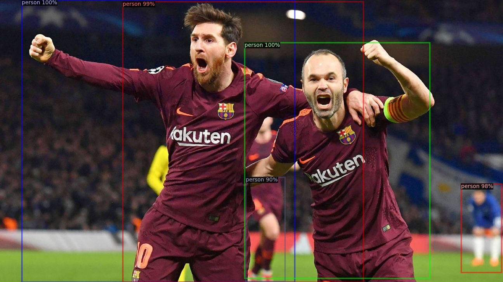

# YOLOv3-Detectron2

A simple YOLOv3/YOLOv3-Tiny implementation on facebook's **Detectron2** framework.

The project code uses official yolov3 [weights](https://pjreddie.com/darknet/yolo/) trained on COCO dataset to initiate
model weights.

## Getting Started

- Install **Detectron2** following
  official [installation instructions](https://detectron2.readthedocs.io/en/latest/tutorials/install.html).
- Install YOLOv3-Detectron2:
  ```
  python setup.py develop
  ```

- Run inference on custom image:
  ```
  # use YOLOv3 official weights 
  python tools/detect.py -i ./imgs/messi.jpg -o ./output/
  ```

- Use COCO pretrain weights to train YOLOv3 model on Pascal VOC dataset:
  ```
  # train on Pascal-VOC dataset
  python tools/train_net.py --config-file configs/PascalVOC-Detection/yolov3_stage1.yaml 
  ```

- Generate anchors by k-means clustering:
  ```
  python tools/gen_anchors.py --config-file configs/gen_anc.yaml --n_clusters 9
  ```

### COCO Detection Baseline

Pretrain weights on COCO:

|      Model      |   AP   |  AP50  |  AP75  |  APs   |  APm   |  APl   |
|:---------------:|:------:|:------:|:------:|:------:|:------:|:------:|
|   YOLOv3-448    | 35.854 | 60.065 | 38.804 | 21.815 | 39.419 | 48.655 |
| YOLOv3-Tiny-416 | 9.175  | 18.744 | 7.977  | 0.246  | 9.591  | 22.219 |

### Pascal-VOC-2007 Results

|     Model      |   AP    |  AP50   |  AP75   | 
|:--------------:|:-------:|:-------:|:-------:|
| YOLOv3-448-s1  | 43.0276 | 75.4494 | 42.2355 |
| YOLOv3-448-s2  | 45.0743 | 77.4321 | 46.3795 |
| YOLOv3-Tiny-s1 | 22.1295 | 53.5904 | 13.7939 |
| YOLOv3-Tiny-s2 | 25.2735 | 59.4528 | 16.7257 |


### Detection Results

